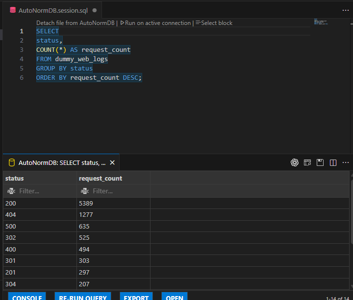

# AutoNormDB

AutoNormDB は `lake/` ディレクトリ以下の Parquet ファイルを自動的に読み込み、[go-mysql-server](https://github.com/dolthub/go-mysql-server) を利用してメモリ上に MySQL 互換サーバーを起動します。起動後は各 Parquet ファイルの拡張子を除いたファイル名がテーブル名として登録され、`AutoNormDB` というデータベースから参照できます。

## 前提条件
- `go.mod` で宣言されているバージョンに合わせた Go 1.24.5 以上
- サーバー起動後にデータへ問い合わせるための MySQL 互換クライアント（例: `mysql` コマンドラインツール）

## サーバーの起動方法
リポジトリのルートで以下を実行します。

```bash
go run main.go
```

このコマンドは `lake/` ディレクトリ配下から Parquet ファイルを検出して読み込み、`localhost:3306` で待ち受ける SQL サーバーを立ち上げます。サーバーを利用する間はプロセスを実行したままにしておき、終了する際は `Ctrl+C` で停止してください。

## MySQL クライアントからの接続
サーバーが起動している状態で、`main.go` に定義されている以下の接続情報を使用します。

- **ホスト:** `localhost`
- **ポート:** `3306`
- **データベース:** `AutoNormDB`
- **テーブル:** `lake/` 配下の Parquet ファイル名（例: `dummy_web_logs.parquet` → テーブル名 `dummy_web_logs`）
- **ユーザー名:** `root`（go-mysql-server のデフォルト）
- **パスワード:** なし

MySQL CLI を使った接続例:

```bash
mysql -h localhost -P 3306 -u root AutoNormDB
```

接続後は、例えば次のようにステータスごとのリクエスト件数を集計できます。

```sql
SELECT
  status,
  COUNT(*) AS request_count
FROM dummy_web_logs
GROUP BY status
ORDER BY request_count DESC;
```

読み込まれたテーブルを活用してデータセットの探索をお楽しみください。

## Parquet テーブルを直接操作する CLI デモ

`cmd/demo/main.go` には、`lake/` 配下の Parquet ファイルを検出して読み込み、SQL を 1 回実行する最小構成のデモが含まれています。テーブル登録には `parquettable.RegisterParquetTable` を利用し、必要な列・RowGroup だけを読み出します。

テーブル一覧を確認するには次のコマンドを実行します。

```bash
go run ./cmd/demo
```

任意のクエリは `-q` フラグで指定できます。`lake/` 以下のファイルパスをテーブル名として指定できるようになったため、Parquet ファイルを直接参照する例は以下の通りです（スラッシュを含む名前はバッククォートで囲みます）。

```bash
go run ./cmd/demo -q "SELECT\n  status,\n  COUNT(*) AS request_count\nFROM `lake/dummy_web_logs.parquet`\nGROUP BY status\nORDER BY request_count DESC;"
```

結果はタブ区切りで標準出力に表示されます。

## SQLTools での実行例
VS Code の [SQLTools](https://marketplace.visualstudio.com/items?itemName=mtxr.sqltools) を利用すると、GUI 上でスキーマの確認やクエリの実行が行えます。

| テーブルスキーマの確認 | 集計クエリの実行 |
| --- | --- |
|  |  |

左のスクリーンショットでは SQLTools のシステムビューから `dummy_web_logs` テーブルに含まれるカラム名とデータ型を確認でき、右のスクリーンショットではステータスごとに件数を集計するクエリを実行した結果を確認できます。
